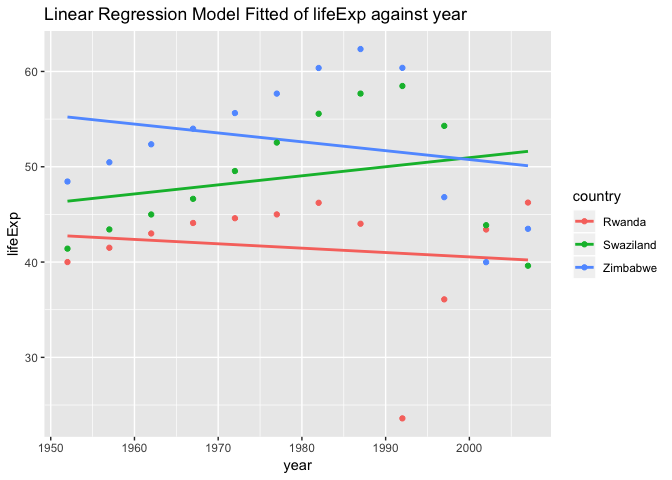
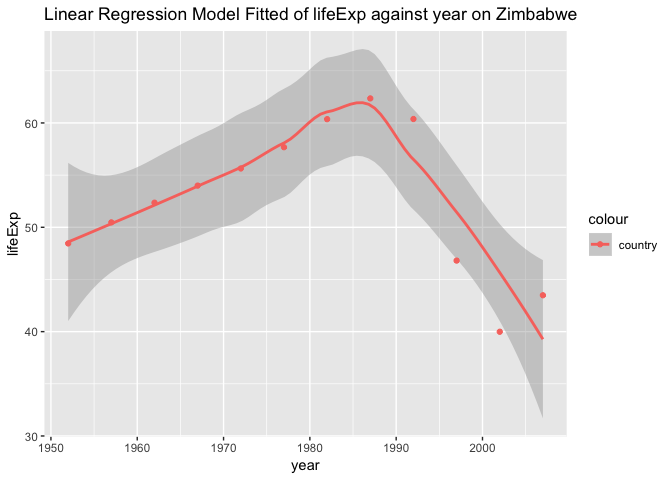

```r
library(gapminder)
library(tidyverse)
```

```
## ── Attaching packages ─────────────────────────────────────── tidyverse 1.2.1 ──
```

```
## ✔ ggplot2 3.0.0     ✔ purrr   0.2.5
## ✔ tibble  1.4.2     ✔ dplyr   0.7.6
## ✔ tidyr   0.8.1     ✔ stringr 1.3.1
## ✔ readr   1.1.1     ✔ forcats 0.3.0
```

```
## ── Conflicts ────────────────────────────────────────── tidyverse_conflicts() ──
## ✖ dplyr::filter() masks stats::filter()
## ✖ dplyr::lag()    masks stats::lag()
```

```r
library(stringr)
library(ggplot2)
```

# 1. Character data
### String length
Try with different type of data, both the number and logical variable are trasferred to string.

```r
str_length(c("This", "is", 233, TRUE))
```

```
## [1] 4 2 3 4
```
### Combining strings

```r
str_c("1", "22", "333")
```

```
## [1] "122333"
```
Combining with a separater:

```r
str_c("Try", "this", sep = "%")
```

```
## [1] "Try%this"
```
### Subsetting strings
str_sub() takes start and end arguments which give the (inclusive) position of the substring:

```r
(x <- c("We ", "ar e ", "family","!"))
```

```
## [1] "We "    "ar e "  "family" "!"
```

```r
str_sub(x, 2, 4)
```

```
## [1] "e "  "r e" "ami" ""
```
### Locales
Changing case:

```r
str_to_upper(c("a", "i"))
```

```
## [1] "A" "I"
```
Sorting by English alphabetically:

```r
str_sort(x, locale = "en")
```

```
## [1] "!"      "ar e "  "family" "We "
```
Removing the wrapping spaces:

```r
str_wrap(x)
```

```
## [1] "We"     "ar e"   "family" "!"
```
### Matching
1.Basic matching:

```r
str_view(x, "a")
```

<!--html_preserve--><div id="htmlwidget-aa80b07f657ad5fde6d8" style="width:960px;height:100%;" class="str_view html-widget"></div>
<script type="application/json" data-for="htmlwidget-aa80b07f657ad5fde6d8">{"x":{"html":"<ul>\n  <li>We <\/li>\n  <li><span class='match'>a<\/span>r e <\/li>\n  <li>f<span class='match'>a<\/span>mily<\/li>\n  <li>!<\/li>\n<\/ul>"},"evals":[],"jsHooks":[]}</script><!--/html_preserve-->
Matching any character with "."

```r
str_view(x, ".a.")
```

<!--html_preserve--><div id="htmlwidget-05a5c79b99b43fa1d745" style="width:960px;height:100%;" class="str_view html-widget"></div>
<script type="application/json" data-for="htmlwidget-05a5c79b99b43fa1d745">{"x":{"html":"<ul>\n  <li>We <\/li>\n  <li>ar e <\/li>\n  <li><span class='match'>fam<\/span>ily<\/li>\n  <li>!<\/li>\n<\/ul>"},"evals":[],"jsHooks":[]}</script><!--/html_preserve-->
2.Anchors
Start matching:

```r
str_view(x, "^a")
```

<!--html_preserve--><div id="htmlwidget-e393704e83a91ddd3ab9" style="width:960px;height:100%;" class="str_view html-widget"></div>
<script type="application/json" data-for="htmlwidget-e393704e83a91ddd3ab9">{"x":{"html":"<ul>\n  <li>We <\/li>\n  <li><span class='match'>a<\/span>r e <\/li>\n  <li>family<\/li>\n  <li>!<\/li>\n<\/ul>"},"evals":[],"jsHooks":[]}</script><!--/html_preserve-->
End matching:

```r
str_view(x, "y$")
```

<!--html_preserve--><div id="htmlwidget-a3cdb2f32e070fc454d9" style="width:960px;height:100%;" class="str_view html-widget"></div>
<script type="application/json" data-for="htmlwidget-a3cdb2f32e070fc454d9">{"x":{"html":"<ul>\n  <li>We <\/li>\n  <li>ar e <\/li>\n  <li>famil<span class='match'>y<\/span><\/li>\n  <li>!<\/li>\n<\/ul>"},"evals":[],"jsHooks":[]}</script><!--/html_preserve-->
3.Character classes and alternatives

```r
str_view(c("abc", "a.c", "a..c", "a.c."), "a[.]c")
```

<!--html_preserve--><div id="htmlwidget-825079e3d9e4094ac76c" style="width:960px;height:100%;" class="str_view html-widget"></div>
<script type="application/json" data-for="htmlwidget-825079e3d9e4094ac76c">{"x":{"html":"<ul>\n  <li>abc<\/li>\n  <li><span class='match'>a.c<\/span><\/li>\n  <li>a..c<\/li>\n  <li><span class='match'>a.c<\/span>.<\/li>\n<\/ul>"},"evals":[],"jsHooks":[]}</script><!--/html_preserve-->
Matching with a "|" character:

```r
str_view(c("brace", "bruce"), "br(a|u)c.")
```

<!--html_preserve--><div id="htmlwidget-06176cd8501e0a7cf0ba" style="width:960px;height:100%;" class="str_view html-widget"></div>
<script type="application/json" data-for="htmlwidget-06176cd8501e0a7cf0ba">{"x":{"html":"<ul>\n  <li><span class='match'>brace<\/span><\/li>\n  <li><span class='match'>bruce<\/span><\/li>\n<\/ul>"},"evals":[],"jsHooks":[]}</script><!--/html_preserve-->
### Repetition


```r
y <- "I'm loooooooving it!"
str_view(y, "oo?")
```

<!--html_preserve--><div id="htmlwidget-15b7cd99cef90540c908" style="width:960px;height:100%;" class="str_view html-widget"></div>
<script type="application/json" data-for="htmlwidget-15b7cd99cef90540c908">{"x":{"html":"<ul>\n  <li>I'm l<span class='match'>oo<\/span>oooooving it!<\/li>\n<\/ul>"},"evals":[],"jsHooks":[]}</script><!--/html_preserve-->
Specify a repitition time:

```r
str_view(y, "o{2,}")
```

<!--html_preserve--><div id="htmlwidget-a4587bac5ede2664121a" style="width:960px;height:100%;" class="str_view html-widget"></div>
<script type="application/json" data-for="htmlwidget-a4587bac5ede2664121a">{"x":{"html":"<ul>\n  <li>I'm l<span class='match'>ooooooo<\/span>ving it!<\/li>\n<\/ul>"},"evals":[],"jsHooks":[]}</script><!--/html_preserve-->
### Tools
Detect matches:

```r
x
```

```
## [1] "We "    "ar e "  "family" "!"
```

```r
str_detect(x, "a")
```

```
## [1] FALSE  TRUE  TRUE FALSE
```
Subsets:

```r
str_subset(words, "go$")
```

```
## [1] "ago" "go"
```
With filtering:

```r
df <- tibble(
  word = words, 
  i = seq_along(word)
)
df %>% 
  filter(str_detect(word, "go$"))
```

```
## # A tibble: 2 x 2
##   word      i
##   <chr> <int>
## 1 ago      24
## 2 go      360
```

Counting:

```r
z <- c("ah","haha","aaaaaa")
str_count(z, "a")
```

```
## [1] 1 2 6
```
Mean:

```r
# The mean of  vowels per word
mean(str_count(z, "[aeiou]"))
```

```
## [1] 3
```

Replacing matches:

```r
x <- c("Escape", "your", "comfort","zone")
# replace the first matching element
str_replace(x, "[aeiou]", "-")
```

```
## [1] "Esc-pe"  "y-ur"    "c-mfort" "z-ne"
```

```r
# replace all matching element
str_replace_all(x, "[aeiou]", "-")
```

```
## [1] "Esc-p-"  "y--r"    "c-mf-rt" "z-n-"
```
### Splitting


```r
(a <- sentences %>%
  head(6) %>% 
  #use "simplify = TRUE" to return a matrix
  str_split(" ", simplify = TRUE))
```

```
##      [,1]    [,2]    [,3]    [,4]      [,5]    [,6]    [,7]    
## [1,] "The"   "birch" "canoe" "slid"    "on"    "the"   "smooth"
## [2,] "Glue"  "the"   "sheet" "to"      "the"   "dark"  "blue"  
## [3,] "It's"  "easy"  "to"    "tell"    "the"   "depth" "of"    
## [4,] "These" "days"  "a"     "chicken" "leg"   "is"    "a"     
## [5,] "Rice"  "is"    "often" "served"  "in"    "round" "bowls."
## [6,] "The"   "juice" "of"    "lemons"  "makes" "fine"  "punch."
##      [,8]          [,9]   
## [1,] "planks."     ""     
## [2,] "background." ""     
## [3,] "a"           "well."
## [4,] "rare"        "dish."
## [5,] ""            ""     
## [6,] ""            ""
```
Find matches

```r
x
```

```
## [1] "Escape"  "your"    "comfort" "zone"
```

```r
str_locate(x, "your")
```

```
##      start end
## [1,]    NA  NA
## [2,]     1   4
## [3,]    NA  NA
## [4,]    NA  NA
```
### Other types of pattern
Apply regex() to control details of the match
Ignore the case:

```r
x
```

```
## [1] "Escape"  "your"    "comfort" "zone"
```

```r
str_view(x, regex("e", ignore_case = TRUE))
```

<!--html_preserve--><div id="htmlwidget-088aef411f4a2d6b21b0" style="width:960px;height:100%;" class="str_view html-widget"></div>
<script type="application/json" data-for="htmlwidget-088aef411f4a2d6b21b0">{"x":{"html":"<ul>\n  <li><span class='match'>E<\/span>scape<\/li>\n  <li>your<\/li>\n  <li>comfort<\/li>\n  <li>zon<span class='match'>e<\/span><\/li>\n<\/ul>"},"evals":[],"jsHooks":[]}</script><!--/html_preserve-->
coll(): compare strings using standard collation rules.

```r
a <- c("A", "a")
str_subset(a, coll("a", ignore_case = TRUE))
```

```
## [1] "A" "a"
```
 use boundary() to match boundaries:

```r
x
```

```
## [1] "Escape"  "your"    "comfort" "zone"
```

```r
str_extract_all(x, boundary("word"))
```

```
## [[1]]
## [1] "Escape"
## 
## [[2]]
## [1] "your"
## 
## [[3]]
## [1] "comfort"
## 
## [[4]]
## [1] "zone"
```
### Other uses of regular expressions
Searching from the global environment:

```r
apropos("split")
```

```
##  [1] "split"              "split.data.frame"   "split.Date"        
##  [4] "split.default"      "split.POSIXct"      "split.screen"      
##  [7] "split<-"            "split<-.data.frame" "split<-.default"   
## [10] "str_split"          "str_split_fixed"    "strsplit"          
## [13] "unsplit"
```

# 6. Work with a nested data frame
### Nest the data by country (and continent')
Let's first grab a sense of the data without nesting:

```r
gap_nested <- gapminder %>% 
   group_by(continent, country)
summary(gap_nested)
```

```
##         country        continent        year         lifeExp     
##  Afghanistan:  12   Africa  :624   Min.   :1952   Min.   :23.60  
##  Albania    :  12   Americas:300   1st Qu.:1966   1st Qu.:48.20  
##  Algeria    :  12   Asia    :396   Median :1980   Median :60.71  
##  Angola     :  12   Europe  :360   Mean   :1980   Mean   :59.47  
##  Argentina  :  12   Oceania : 24   3rd Qu.:1993   3rd Qu.:70.85  
##  Australia  :  12                  Max.   :2007   Max.   :82.60  
##  (Other)    :1632                                                
##       pop              gdpPercap       
##  Min.   :6.001e+04   Min.   :   241.2  
##  1st Qu.:2.794e+06   1st Qu.:  1202.1  
##  Median :7.024e+06   Median :  3531.8  
##  Mean   :2.960e+07   Mean   :  7215.3  
##  3rd Qu.:1.959e+07   3rd Qu.:  9325.5  
##  Max.   :1.319e+09   Max.   :113523.1  
## 
```

```r
gap_nested %>% 
  head(10) 
```

```
## # A tibble: 10 x 6
## # Groups:   continent, country [1]
##    country     continent  year lifeExp      pop gdpPercap
##    <fct>       <fct>     <int>   <dbl>    <int>     <dbl>
##  1 Afghanistan Asia       1952    28.8  8425333      779.
##  2 Afghanistan Asia       1957    30.3  9240934      821.
##  3 Afghanistan Asia       1962    32.0 10267083      853.
##  4 Afghanistan Asia       1967    34.0 11537966      836.
##  5 Afghanistan Asia       1972    36.1 13079460      740.
##  6 Afghanistan Asia       1977    38.4 14880372      786.
##  7 Afghanistan Asia       1982    39.9 12881816      978.
##  8 Afghanistan Asia       1987    40.8 13867957      852.
##  9 Afghanistan Asia       1992    41.7 16317921      649.
## 10 Afghanistan Asia       1997    41.8 22227415      635.
```
And now nest the data:

```r
(gap_nested <- gap_nested %>% 
   nest())
```

```
## # A tibble: 142 x 3
##    continent country     data             
##    <fct>     <fct>       <list>           
##  1 Asia      Afghanistan <tibble [12 × 4]>
##  2 Europe    Albania     <tibble [12 × 4]>
##  3 Africa    Algeria     <tibble [12 × 4]>
##  4 Africa    Angola      <tibble [12 × 4]>
##  5 Americas  Argentina   <tibble [12 × 4]>
##  6 Oceania   Australia   <tibble [12 × 4]>
##  7 Europe    Austria     <tibble [12 × 4]>
##  8 Asia      Bahrain     <tibble [12 × 4]>
##  9 Asia      Bangladesh  <tibble [12 × 4]>
## 10 Europe    Belgium     <tibble [12 × 4]>
## # ... with 132 more rows
```

We now see there are seperate tibbles for different countries.

### Fit a model of life expectancy against year
Let's see the change of lifeExp over year of China:

```r
(my_lm <- lm(lifeExp ~ log(gdpPercap), data=gap_nested[[25, "data"]]))
```

```
## 
## Call:
## lm(formula = lifeExp ~ log(gdpPercap), data = gap_nested[[25, 
##     "data"]])
## 
## Coefficients:
##    (Intercept)  log(gdpPercap)  
##         -15.73           11.09
```

```r
ggplot(gap_nested[[25, "data"]], aes(year, lifeExp)) +
    geom_point() +
    geom_smooth(method="lm") +
    ggtitle("Linear Regression Model Fitted of lifeExp against year on China")
```

<!-- -->

### Apply a function map() and mutate()

```r
# the fitted model
my_lm <- function(df) {
  lm(lifeExp ~ I(year - 1950), data = df)
}
my_lm(gap_nested[[25, "data"]])
```

```
## 
## Call:
## lm(formula = lifeExp ~ I(year - 1950), data = df)
## 
## Coefficients:
##    (Intercept)  I(year - 1950)  
##        46.1291          0.5307
```

```r
#map() the fitting function my_lm() to the 25th(China) and 26th(Colombia) elements of gap_nested$data.
fits <- map(gap_nested$data[25:26], my_lm)
fits
```

```
## [[1]]
## 
## Call:
## lm(formula = lifeExp ~ I(year - 1950), data = df)
## 
## Coefficients:
##    (Intercept)  I(year - 1950)  
##        46.1291          0.5307  
## 
## 
## [[2]]
## 
## Call:
## lm(formula = lifeExp ~ I(year - 1950), data = df)
## 
## Coefficients:
##    (Intercept)  I(year - 1950)  
##        52.6656          0.3808
```
Scale this up to all countries:

```r
(gap_nested <- gap_nested %>% 
   mutate(fit = map(data, my_lm)))
```

```
## # A tibble: 142 x 4
##    continent country     data              fit     
##    <fct>     <fct>       <list>            <list>  
##  1 Asia      Afghanistan <tibble [12 × 4]> <S3: lm>
##  2 Europe    Albania     <tibble [12 × 4]> <S3: lm>
##  3 Africa    Algeria     <tibble [12 × 4]> <S3: lm>
##  4 Africa    Angola      <tibble [12 × 4]> <S3: lm>
##  5 Americas  Argentina   <tibble [12 × 4]> <S3: lm>
##  6 Oceania   Australia   <tibble [12 × 4]> <S3: lm>
##  7 Europe    Austria     <tibble [12 × 4]> <S3: lm>
##  8 Asia      Bahrain     <tibble [12 × 4]> <S3: lm>
##  9 Asia      Bangladesh  <tibble [12 × 4]> <S3: lm>
## 10 Europe    Belgium     <tibble [12 × 4]> <S3: lm>
## # ... with 132 more rows
```
Now we have an extra list of fitted linear models.

### Other information out of the linear models:
1."tidy" Intercept and  slope:

```r
library(broom)
tidy(gap_nested$fit[[25]]) 
```

```
## # A tibble: 2 x 5
##   term           estimate std.error statistic       p.value
##   <chr>             <dbl>     <dbl>     <dbl>         <dbl>
## 1 (Intercept)      46.1      2.20       20.9  0.00000000138
## 2 I(year - 1950)    0.531    0.0645      8.23 0.00000921
```
Extend to all other countries:

```r
(gap_nested <- gap_nested %>% 
  mutate(tidy = map(fit, tidy)))
```

```
## # A tibble: 142 x 5
##    continent country     data              fit      tidy            
##    <fct>     <fct>       <list>            <list>   <list>          
##  1 Asia      Afghanistan <tibble [12 × 4]> <S3: lm> <tibble [2 × 5]>
##  2 Europe    Albania     <tibble [12 × 4]> <S3: lm> <tibble [2 × 5]>
##  3 Africa    Algeria     <tibble [12 × 4]> <S3: lm> <tibble [2 × 5]>
##  4 Africa    Angola      <tibble [12 × 4]> <S3: lm> <tibble [2 × 5]>
##  5 Americas  Argentina   <tibble [12 × 4]> <S3: lm> <tibble [2 × 5]>
##  6 Oceania   Australia   <tibble [12 × 4]> <S3: lm> <tibble [2 × 5]>
##  7 Europe    Austria     <tibble [12 × 4]> <S3: lm> <tibble [2 × 5]>
##  8 Asia      Bahrain     <tibble [12 × 4]> <S3: lm> <tibble [2 × 5]>
##  9 Asia      Bangladesh  <tibble [12 × 4]> <S3: lm> <tibble [2 × 5]>
## 10 Europe    Belgium     <tibble [12 × 4]> <S3: lm> <tibble [2 × 5]>
## # ... with 132 more rows
```
Now we have a tidy column of several tibbles.

2. One row summary using glance():

```r
glance(gap_nested$fit[[25]])
```

```
## # A tibble: 1 x 11
##   r.squared adj.r.squared sigma statistic p.value    df logLik   AIC   BIC
## *     <dbl>         <dbl> <dbl>     <dbl>   <dbl> <int>  <dbl> <dbl> <dbl>
## 1     0.871         0.858  3.86      67.7 9.21e-6     2  -32.1  70.3  71.7
## # ... with 2 more variables: deviance <dbl>, df.residual <int>
```
Looks like we get a bunch of statistical data:)

3. Augment the original data with other columns:

```r
augment(gap_nested$fit[[25]])
```

```
## # A tibble: 12 x 9
##    lifeExp I.year...1950. .fitted .se.fit .resid   .hat .sigma .cooksd
##  *   <dbl>       <I(dbl)>   <dbl>   <dbl>  <dbl>  <dbl>  <dbl>   <dbl>
##  1    44                2    47.2    2.09 -3.19  0.295    3.86 2.03e-1
##  2    50.5              7    49.8    1.83  0.705 0.225    4.06 6.25e-3
##  3    44.5             12    52.5    1.59 -8.00  0.169    2.82 5.26e-1
##  4    58.4             17    55.2    1.37  3.23  0.127    3.90 5.85e-2
##  5    63.1             22    57.8    1.21  5.31  0.0991   3.61 1.16e-1
##  6    64.0             27    60.5    1.13  3.51  0.0851   3.88 4.21e-2
##  7    65.5             32    63.1    1.13  2.41  0.0851   3.98 1.99e-2
##  8    67.3             37    65.8    1.21  1.51  0.0991   4.03 9.33e-3
##  9    68.7             42    68.4    1.37  0.271 0.127    4.06 4.11e-4
## 10    70.4             47    71.1    1.59 -0.647 0.169    4.06 3.44e-3
## 11    72.0             52    73.7    1.83 -1.70  0.225    4.01 3.63e-2
## 12    73.0             57    76.4    2.09 -3.42  0.295    3.83 2.33e-1
## # ... with 1 more variable: .std.resid <dbl>
```
Now we have several colums, with the fitted rows of lifeExp.
4. unnest the data in the dataframe:

```r
(gap_coefs <- gap_nested %>% 
   select(continent, country, tidy) %>% 
   unnest())
```

```
## # A tibble: 284 x 7
##    continent country     term        estimate std.error statistic  p.value
##    <fct>     <fct>       <chr>          <dbl>     <dbl>     <dbl>    <dbl>
##  1 Asia      Afghanistan (Intercept)   29.4     0.699       42.0  1.40e-12
##  2 Asia      Afghanistan I(year - 1…    0.275   0.0205      13.5  9.84e- 8
##  3 Europe    Albania     (Intercept)   58.6     1.13        51.7  1.79e-13
##  4 Europe    Albania     I(year - 1…    0.335   0.0332      10.1  1.46e- 6
##  5 Africa    Algeria     (Intercept)   42.2     0.756       55.8  8.22e-14
##  6 Africa    Algeria     I(year - 1…    0.569   0.0221      25.7  1.81e-10
##  7 Africa    Angola      (Intercept)   31.7     0.804       39.4  2.63e-12
##  8 Africa    Angola      I(year - 1…    0.209   0.0235       8.90 4.59e- 6
##  9 Americas  Argentina   (Intercept)   62.2     0.167      372.   4.80e-22
## 10 Americas  Argentina   I(year - 1…    0.232   0.00489     47.4  4.22e-13
## # ... with 274 more rows
```
5. Adding the previous scope and intercept with recode():

```r
(gap_coefs <- gap_coefs %>%
   mutate(term = recode(term,
                        `(Intercept)` = "intercept",
                        `I(year - 1950)` = "slope")))
```

```
## # A tibble: 284 x 7
##    continent country     term      estimate std.error statistic  p.value
##    <fct>     <fct>       <chr>        <dbl>     <dbl>     <dbl>    <dbl>
##  1 Asia      Afghanistan intercept   29.4     0.699       42.0  1.40e-12
##  2 Asia      Afghanistan slope        0.275   0.0205      13.5  9.84e- 8
##  3 Europe    Albania     intercept   58.6     1.13        51.7  1.79e-13
##  4 Europe    Albania     slope        0.335   0.0332      10.1  1.46e- 6
##  5 Africa    Algeria     intercept   42.2     0.756       55.8  8.22e-14
##  6 Africa    Algeria     slope        0.569   0.0221      25.7  1.81e-10
##  7 Africa    Angola      intercept   31.7     0.804       39.4  2.63e-12
##  8 Africa    Angola      slope        0.209   0.0235       8.90 4.59e- 6
##  9 Americas  Argentina   intercept   62.2     0.167      372.   4.80e-22
## 10 Americas  Argentina   slope        0.232   0.00489     47.4  4.22e-13
## # ... with 274 more rows
```
6. Reshaping the estimates of each continents and make a summary:

```r
(gap_ests <- gap_coefs %>% 
   select(continent:estimate) %>% 
   spread(key = term, value = estimate))
```

```
## # A tibble: 142 x 4
##    continent country                  intercept  slope
##    <fct>     <fct>                        <dbl>  <dbl>
##  1 Africa    Algeria                       42.2 0.569 
##  2 Africa    Angola                        31.7 0.209 
##  3 Africa    Benin                         38.9 0.334 
##  4 Africa    Botswana                      52.8 0.0607
##  5 Africa    Burkina Faso                  34.0 0.364 
##  6 Africa    Burundi                       40.3 0.154 
##  7 Africa    Cameroon                      40.7 0.250 
##  8 Africa    Central African Republic      38.4 0.184 
##  9 Africa    Chad                          39.3 0.253 
## 10 Africa    Comoros                       39.1 0.450 
## # ... with 132 more rows
```

```r
gap_ests %>% 
  select(intercept, slope) %>% 
  summary()
```

```
##    intercept         slope         
##  Min.   :27.24   Min.   :-0.09302  
##  1st Qu.:39.36   1st Qu.: 0.20832  
##  Median :47.42   Median : 0.32145  
##  Mean   :49.86   Mean   : 0.32590  
##  3rd Qu.:62.05   3rd Qu.: 0.44948  
##  Max.   :71.95   Max.   : 0.77218
```
6. Making a plot of the whole distribution:

```r
ggplot(gap_coefs, aes(x = estimate)) +
  geom_density() + 
  # assing a density projection on the x-axis
  geom_rug() +
  # using scales to expand the plot throughly
  facet_wrap(~ term, scales = "free")
```

<!-- -->

Inspiration for the modelling and downstream inspiration：
* From the plot of linear regression model fitted on China, it is easy to notice that the linear model doesn't fitted very well. There is a dramatical change of lifeExp between 1950s and 1970s. And the the slope becomes smallers.
* From the residual we notice that during the high range of lifeExp, say 70+, it doesn't performs that well cause it stays negative and keeps going down. While from 58 to 70+, it keeps going done.

* From the std.error we can also find that the data of Zimbabwe, Rwanda and Swaziland seems not that suitable for our model.
Let's see what's going on:

```r
other <- gapminder %>% 
  filter(country == "Zimbabwe" | country == "Rwanda" | country == "Swaziland") %>% 
  data.frame()
other %>% 
  ggplot(aes(year, lifeExp, colour=country)) +
  geom_smooth(se = FALSE,method = "lm") + # fit linear regression
  geom_point() +
  ggtitle("Linear Regression Model Fitted of lifeExp against year")
```

<!-- -->

What if we try some different methods? Maybe for one distinct country loess performs better. However this can be overfitting when it is extended.


```r
other %>% 
  filter(country == "Zimbabwe") %>% 
  ggplot(aes(year, lifeExp, colour = "country")) +
  geom_smooth(method = "loess") + # fit linear regression
  geom_point() +
  ggtitle("Linear Regression Model Fitted of lifeExp against year on Zimbabwe")
```

<!-- -->

